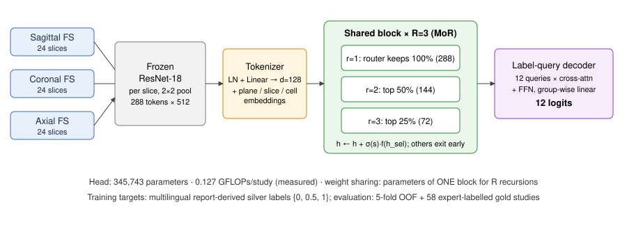

# MV-MoR: a multi-view Mixture-of-Recursions framework for RSNA Knee Abnormality Detection

This is a reproducible, leakage-safe pipeline for the Kaggle competition
[RSNA Knee Abnormality Detection](https://www.kaggle.com/competitions/rsna-knee-abnormality-detection).
The competition asks for 12 study-level findings from multi-sequence knee MRI, scored by macro AUC-ROC.

The proposed model is **MV-MoR** (*multi-view Mixture-of-Recursions*). It is a compact head that runs over
slice tokens from all three MRI planes jointly:

* **one** transformer block, reused recursively;
* token-level routing in the style of Mixture-of-Recursions (Bae et al., 2025);
* per-label query decoding.

> Every number below was **measured** in this repository on a CPU-only cloud container (4 vCPU, 15 GB RAM,
> no GPU). Nothing is projected. The Kaggle hidden-test leaderboard score is **unknown**: kaggle.com is not
> reachable from the container, so no submission was made. See §10.

---

## 1. Problem definition

| Item | Value |
|---|---|
| Input | One knee MRI study: 3–14 series with sagittal, coronal and axial planes, some fat-suppressed or fluid-sensitive |
| Output | 12 probabilities: ACL, MCL, Medial Meniscus, Lateral Meniscus, Medial OA, Lateral OA, PF OA, Effusion, Synovitis, Baker's cyst, Contusion, Fracture |
| Metric | Macro AUC-ROC over the 12 labels (competition metric) |
| Training data | 4,407 studies (24,371 series, 819,635 DICOMs, 265 GB zipped). **Only 58 studies carry expert labels.** The other 4,349 come with a free-text report in eight languages |
| Test data | Hidden. The bundle contains 3 demo studies. **No reports at test time**, so the model must be image-only |
| Constraints (this run) | CPU only, ~30 GB disk: the archive can never be stored whole |

**Objectives.**
1. Turn multilingual reports into training labels and **measure** their noise against the 58 gold studies.
2. Build an image-only multi-view classifier.
3. Compare it with strong baselines under an identical protocol.
4. Isolate each component through ablations.
5. Report efficiency, robustness, explainability and failure modes.

**Hypotheses** (see [`docs/literature_review.md`](docs/literature_review.md) for background and the research gap):

* **H1.** Label-specific attention over joint multi-plane tokens beats pooling heads (mean-pool MLP, logistic
  regression, ABMIL).
* **H2.** A weight-shared recursive block matches an unshared transformer of equal depth with fewer parameters.
* **H3.** MoR token routing lowers FLOPs relative to full-depth recursion without losing AUC.
* **H4.** Multi-plane input beats sagittal-only input.

## 2. Pipeline

```
265 GB remote zip ──(HTTP range, 1 GET per series)──► DICOM decode (headers first, only needed slices)
   └─► per study: best series per plane (fluid-sensitive > fat-sat), sort along slice normal,
       24 evenly spaced slices, 160×160, 0.5/99.5-percentile → uint8          [src/kneemor/ingest.py]
multilingual reports ──► rule-based labeler (mention + negation + uncertainty) ──► silver {0, .5, 1}
                                                                              [src/kneemor/report_labeler.py]
volumes ──► frozen ImageNet ResNet-18 (timm RSB-A1) per slice ──► 2×2 pooled 512-d tokens
       = 3 planes × 24 slices × 4 cells = 288 tokens / study                 [src/kneemor/features.py]
tokens ──► head (MV-MoR or baseline) ──► 12 logits                            [src/kneemor/models.py]
5-fold CV on silver pool + gold evaluation, bootstrap statistics             [train.py, evaluate.py]
```

* **Data quality.** All 4,407 studies were ingested with 0 errors, and every study had all three planes.
  The series metadata log covers 3,486 studies because the first ingest pass was restarted; the image volumes
  cover all 4,407. Scanners: Siemens, GE, Philips and Toshiba at 1.0–3.0 T (6,051 series at 1.5 T, 3,819 at
  3 T). The median series has 30 slices (range 12–320).
* **Series choice uses DICOM-derived metadata only** (plane, fluid-sensitive, fat-suppressed), which is also
  available at test time.
* **Inference parity.** [`src/kneemor/infer.py`](src/kneemor/infer.py) reads raw local DICOM folders, as on
  Kaggle. On the 3 demo test studies its predictions match the streamed training-time path to within
  3×10⁻⁸ ([`results/submission_demo.csv`](results/submission_demo.csv)).

### 2.1 Multilingual report labeler (weak supervision)

Report languages, by a heuristic language ID:

| Language | Studies |
|---|---|
| English | 2,113 |
| Spanish | 679 |
| Turkish | 527 |
| Croatian | 448 |
| German | 224 |
| Bulgarian | 220 (tagged `ru` in the code) |
| Dutch | 169 |
| French | 27 |

The labeler works in five steps:

1. Normalise the text (lower-case, strip Latin diacritics).
2. Drop history, indication and question sentences.
3. Attach each finding term to the **nearest** anatomical structure, in either word order.
4. Scope negation and uncertainty cues to the clause. A sentence-initial negation carries over to list items.
5. Split OA mentions by compartment, including "tricompartmental".

The rules were written from *unlabelled* reports. One regex bug was then found through a sanity check on
silver prevalence (medial meniscus came out at 1%). After that fix the rules were frozen, and the gold
studies were used for measurement only.

**Labeler vs 58 gold studies** (measured, [`results/report_labeler_gold_eval.csv`](results/report_labeler_gold_eval.csv)):

| | ACL | MCL | MedMen | LatMen | MedOA | LatOA | PF OA | Effusion | Synovitis | Baker's | Contusion | Fracture | **Macro** |
|---|---|---|---|---|---|---|---|---|---|---|---|---|---|
| AUC | .925 | .806 | .803 | .806 | .688 | .550 | .619 | .625 | .639 | .821 | .779 | .756 | **.735** |
| Sensitivity | .92 | .78 | .77 | .65 | .40 | .18 | .24 | .86 | .41 | .75 | .79 | .61 | |

The labeler reads the report itself and still reaches only **0.735 macro AUC**. So the silver labels differ
systematically from the expert labels, especially for OA grading, effusion (whose specificity is 0.30) and
synovitis. This sets a practical ceiling for any model trained on these silver labels.

## 3. Proposed model: MV-MoR



Notation: $x\in\mathbb R^{P\times D\times G\times 512}$ are the frozen tokens, with $P=3$ planes, $D=24$
slices and $G=4$ spatial cells, giving $T=288$ tokens; $d=128$.

1. **Tokeniser.** $h_0=\mathrm{Lin}(\mathrm{LN}(x))+e^{\text{plane}}_p+e^{\text{slice}}_{p,s}+e^{\text{cell}}_g$.
   The plane and slice embeddings let one sequence mix views while keeping view identity; a missing plane is
   handled as key padding.
2. **Shared recursive block with MoR routing.** A single pre-LN transformer block
   $f(\cdot)=\mathrm{Block}(\cdot)-\mathrm{id}$ is applied $R=3$ times. At step $r$ a linear router scores the
   tokens that are still active, $s=w_r^\top h$, and keeps the top $k_r=\lceil c_r T\rceil$ with
   $c=(1, 0.5, 0.25)$ (expert-choice routing). Only the kept tokens are updated, and they attend only to each
   other: $h\leftarrow h+\sigma(s)\,f(h_{\text{sel}})$. The sigmoid gate makes the router trainable through the
   task loss.
   * **Parameters** equal those of *one* block, whatever $R$ is.
   * **Compute** is $T+T/2+T/4$ token-passes instead of $3T$ (attention grows as $\sum_r k_r^2$), so most
     slice tokens, which show off-target anatomy, exit early.
3. **Label-query decoder.** 12 learned queries cross-attend to the final tokens, followed by an FFN. A
   group-wise linear layer turns the 12 query outputs into 12 logits.
4. **Loss.** BCE against soft silver targets: 0.5 means "uncertain".

The head has 345,743 parameters and runs at 0.127 GFLOPs per study (measured).

## 4. Experimental protocol (identical for every model)

* **Gold test set.** The 58 expert-labelled studies. They are never used for training, early stopping, model
  selection or hyper-parameters.
* **Silver pool.** The other 4,349 studies, split into 5 folds stratified on the number of positive labels and
  ACL status, with a fixed seed ([`results/folds.csv`](results/folds.csv)).
  * **OOF (out-of-fold) AUC.** Each study is predicted by the fold model that did not train on it. It is
    scored against silver labels, excluding uncertain (0.5) entries label by label.
  * **Gold AUC.** Each fold model predicts the 58 gold studies, and the predictions are averaged over the 5
    fold models.
* **Shared budget.** Fixed from a leakage-safe pilot ([`src/kneemor/pilot.py`](src/kneemor/pilot.py),
  [`results/pilot/`](results/pilot/)) that used only the training part of fold 0, split 85/15:
  * 10 epochs, AdamW (weight decay 0.05), OneCycle schedule, batch size 32;
  * learning rate 5e-4 for attention heads and 1e-3 for MIL/MLP heads, each chosen on the pilot split;
  * no early stopping.
* **Augmentation** is applied in feature space: whole-plane dropout (p = 0.15) and slice-token masking
  (p = 0.1).
* **Seeds.** Three seeds (0, 1, 2) for the proposed model and for every neural baseline; one seed (0) for the
  ablations. Logistic regression is deterministic.
* **Statistics.**
  * 95% CIs from a study-level bootstrap: 1,000 resamples on gold, 200 on OOF.
  * Paired bootstrap for differences, **seed 0 against seed 0**, so no model gets an ensembling advantage.
  * Threshold-dependent metrics use per-label Youden thresholds fitted on OOF, never on gold.
* **Sanity check.** Random features give an AUC of about 0.5 through the same code path.

## 5. Results (measured)

### 5.1 Main comparison

([`results/summary.csv`](results/summary.csv))

| Model | Params (head) | OOF macro AUC, per seed mean ± sd | Gold macro AUC, per seed mean ± sd | Gold AUC, seed ensemble [95% CI] |
|---|---|---|---|---|
| Logistic regression (mean-pooled 3×512) | 18k | 0.753 | 0.665 | 0.665 [0.612, 0.717] |
| ABMIL, gated attention (Ilse 2018) | 113k | 0.775 ± 0.000 | 0.702 ± 0.000 | 0.701 [0.636, 0.757] |
| Mean-pool MLP (per-plane means) | 400k | **0.792 ± 0.001** | 0.699 ± 0.002 | 0.699 [0.641, 0.753] |
| Transformer, 3 unshared blocks + label queries | 610k | 0.778 ± 0.001 | 0.693 ± 0.001 | 0.695 [0.628, 0.754] |
| **MV-MoR (proposed)** | **346k** | 0.784 ± 0.001 | 0.700 ± 0.006 | **0.705** [0.641, 0.762] |
| *Reference: report labeler (needs the report, so not usable at test time)* | – | – | 0.735 | – |

### 5.2 Paired comparison, MV-MoR seed 0 against each model's seed 0

([`results/paired_seed0_vs_ref.csv`](results/paired_seed0_vs_ref.csv))

The ΔAUC columns give MV-MoR's AUC minus the other model's.

| Other model | ΔAUC OOF [95% CI], p | ΔAUC gold [95% CI], p |
|---|---|---|
| Logistic regression | **+0.031** [0.023, 0.038], p < 0.005 | +0.031 [−0.006, 0.071], p = 0.10 |
| ABMIL | **+0.009** [0.006, 0.013], p < 0.005 | −0.006 [−0.033, 0.019], p = 0.66 |
| Mean-pool MLP | **−0.009** [−0.013, −0.005], p < 0.005 | −0.003 [−0.030, 0.023], p = 0.83 |
| Transformer (unshared) | **+0.005** [0.002, 0.009], p < 0.005 | +0.005 [−0.012, 0.024], p = 0.58 |

### 5.3 Ablations (seed 0; ΔAUC is MV-MoR minus the ablation)

| Ablation | Params | GFLOPs | OOF AUC | ΔAUC OOF, p | Gold AUC | ΔAUC gold, p |
|---|---|---|---|---|---|---|
| **MV-MoR (full)** | 346k | 0.127 | 0.784 | – | 0.696 | – |
| No routing: shared block, full depth | 345k | 0.174 | 0.778 | **+0.006**, p < 0.005 | 0.693 | +0.003, p = 0.75 |
| R = 1: one pass, no recursion | 345k | 0.099 | 0.785 | −0.001, p = 0.56 | 0.702 | −0.007, p = 0.41 |
| Unshared blocks + routing | 611k | 0.127 | 0.784 | −0.001, p = 0.76 | 0.702 | −0.006, p = 0.39 |
| Mean decoder instead of label queries | 212k | 0.104 | 0.783 | +0.001, p = 0.73 | 0.696 | 0.000, p = 0.97 |
| No plane embedding | 345k | 0.127 | 0.784 | +0.000, p = 0.84 | 0.706 | −0.010, p = 0.11 |
| Sagittal plane only | 346k | – | 0.767 | **+0.016**, p < 0.005 | 0.682 | +0.014, p = 0.48 |

### 5.4 Per-label AUC for MV-MoR (3-seed ensemble)

([`results/per_label_auc.csv`](results/per_label_auc.csv))

| | ACL | MCL | MedMen | LatMen | MedOA | LatOA | PF OA | Eff. | Syn. | Baker | Cont. | Fx |
|---|---|---|---|---|---|---|---|---|---|---|---|---|
| OOF (silver) | .806 | .744 | .749 | .738 | .824 | .800 | .819 | .839 | .872 | .774 | .785 | .774 |
| Gold | .743 | .599 | .588 | .745 | .784 | .716 | .674 | .745 | .578 | .806 | .804 | .681 |

On gold, at OOF-fitted Youden thresholds, MV-MoR averages sensitivity 0.72, specificity 0.54, precision
0.45 and F1 0.54 over the 12 labels. Specificity is low because the gold set is heavily enriched: gold
prevalence is 16–60% against 5–39% for silver, so thresholds fitted on the silver distribution are too low
for gold ([`results/gold_threshold_metrics.csv`](results/gold_threshold_metrics.csv)).

### 5.5 Efficiency

Measured on CPU, 1 thread, batch of 1 study ([`results/efficiency.json`](results/efficiency.json)). The
latencies were measured while other jobs shared the machine, so read them as relative. FLOPs come from
`torch.utils.flop_counter` on the actual routed graph.

| Component | Params | GFLOPs / study | Median latency (ms) |
|---|---|---|---|
| Frozen ResNet-18 over 72 slices at 160² (shared by all heads) | 11.18 M | 133.2 | 2,527 |
| MV-MoR head | 0.346 M | 0.127 | 12.7 |
| Full-depth shared recursion (no routing) | 0.345 M | 0.174 | 17.6 |
| Unshared transformer | 0.610 M | 0.174 | 19.6 |
| ABMIL | 0.113 M | 0.058 | 1.5 |
| Mean-pool MLP | 0.400 M | 0.001 | 0.4 |

Training cost per seed (5 folds, 1 CPU thread, measured) was about 1.7 h for MV-MoR against about 3.1 h
for both the unshared transformer and the no-routing variant. Routing about halves the training cost.

### 5.6 Robustness, explainability and error analysis

([`results/analysis.json`](results/analysis.json), fold models of MV-MoR seed 0)

**Missing plane at inference** (the model was trained with plane dropout):

| Plane removed | Gold AUC | OOF AUC |
|---|---|---|
| None (all planes) | 0.696 | 0.784 |
| Sagittal | 0.686 | 0.770 |
| Coronal | 0.688 | 0.769 |
| Axial | 0.704 | 0.762 |

Degradation is graceful.

**Image perturbations on gold**, re-encoded through the backbone:

| Perturbation | Gold AUC |
|---|---|
| None | 0.696 |
| Gaussian noise, σ = 0.05 | 0.694 |
| γ = 0.7 | 0.688 |
| γ = 1.5 | 0.704 |
| 2× down-sampling | 0.686 |

All changes are ≤ 0.010, well inside the gold CI.

**Router depth** (mean number of recursions per token):

| Plane | Mean depth | Pattern across slices |
|---|---|---|
| Sagittal | 1.69 | Flat |
| Coronal | 1.76 | Rises toward the posterior slices |
| Axial | 1.80 | U-shaped: 2.0–2.2 at the ends of the stack, about 1.55 in the middle |

So the router does **not** spend compute uniformly, but the pattern is not obviously anatomical. It is at
least as consistent with the router keying on intensity or field-of-view statistics of the edge slices.

**Label-query attention per plane** is only weakly specific: every label spends 16–44% of its attention on
each plane. Plausible cases:
* medial meniscus → 44% sagittal;
* the three OA labels → mostly sagittal and coronal.

Implausible cases:
* ACL splits almost evenly across planes;
* Baker's cyst uses the axial plane least (16%), although axial is the usual diagnostic plane.

This attention should therefore **not** be read as a clinically faithful explanation.

**Error analysis, OOF AUC:**

| By report language | n | OOF AUC |
|---|---|---|
| English | 2,083 | 0.801 |
| Spanish | 669 | 0.771 |
| Dutch | 166 | 0.767 |
| Bulgarian | 217 | 0.754 |
| Turkish | 520 | 0.744 |
| Croatian | 444 | 0.741 |
| German | 223 | 0.731 |
| French | 27 | 0.698 |

The spread across languages mostly reflects labeler quality: the rules are richest for English.

| By vendor | n | OOF AUC |
|---|---|---|
| Siemens | 1,551 | 0.782 |
| GE | 699 | 0.785 |
| Philips | 998 | 0.762 |
| Toshiba | 134 | **0.710** |

Toshiba is a possible domain-shift failure mode.

**Weakest gold labels:** Medial Meniscus (0.59), Synovitis (0.58) and MCL (0.60; only 9 positives).
Synovitis and effusion are exactly where the labeler disagrees most with gold. Meniscal tears are small
structures that 2×2-pooled frozen ImageNet features probably cannot resolve.

### 5.7 Hybrid global-local head (MV-MoR-H), added after the main study

**Design** (`HybridMVMoR` in [`src/kneemor/models.py`](src/kneemor/models.py)). The main study showed that
the per-plane mean-pool MLP is the strongest head on OOF, while MV-MoR is competitive on gold. The hybrid
therefore trains both as one network over the same tokens:

* **Global branch** $z_g$: an MLP over per-plane mean-pooled tokens, aimed at diffuse findings such as
  effusion and OA.
* **Local branch** $z_l$: MV-MoR (recursive routed tokens with label queries), aimed at focal findings such
  as tears and cysts.
* **Fusion:** a per-label convex gate, $z=a\,z_g+(1-a)\,z_l$ with $a=\sigma(g_\ell)$.
* **Deep supervision:** the loss is $\mathcal L=\mathrm{BCE}(z)+0.5\,[\mathrm{BCE}(z_g)+\mathrm{BCE}(z_l)]$.
* **Size:** 745k parameters and 0.128 GFLOPs per study (measured). The routed branch accounts for almost all
  of the FLOPs.
* **Protocol:** identical to the main study (10 epochs, lr 5e-4, same folds, 3 seeds). Two ablations use seed
  0. The comparison also includes a **post-hoc average** of the separately trained MLP and MV-MoR
  (`avg_mlp_mvmor`, with the seeds paired).

**Results, averaged over 3 seeds** ([`results/summary.csv`](results/summary.csv)):

| Model | Params | OOF AUC | Gold AUC | Gold AUC, 3-seed ensemble [95% CI] |
|---|---|---|---|---|
| Mean-pool MLP | 400k | 0.792 ± 0.001 | 0.699 ± 0.002 | 0.699 [0.641, 0.753] |
| MV-MoR | 346k | 0.784 ± 0.001 | 0.700 ± 0.006 | 0.705 [0.641, 0.762] |
| Post-hoc average MLP + MV-MoR | 745k | **0.797 ± 0.001** | 0.706 ± 0.003 | 0.705 [0.643, 0.762] |
| **Hybrid MV-MoR-H** | 745k | 0.792 ± 0.002 | **0.711 ± 0.007** | **0.713** [0.651, 0.769] |

**Paired tests, seed 0 vs seed 0** ([`results/paired_seed0_vs_hybrid.csv`](results/paired_seed0_vs_hybrid.csv)).
Hybrid seed 0 scores OOF 0.794 and gold 0.720. Each Δ is the hybrid's AUC minus the other model's.

| Other model | ΔAUC OOF, p | ΔAUC gold [95% CI], p |
|---|---|---|
| MV-MoR | +0.011, p < 0.005 | **+0.025** [0.010, 0.040], p < 0.005 |
| Mean-pool MLP | +0.001, p = 0.33 | +0.022 [0.003, 0.040], p = 0.024 |
| Post-hoc average MLP + MV-MoR | −0.003, p = 0.03 | +0.019 [0.008, 0.029], p < 0.005 |
| Hybrid without deep supervision | +0.005, p < 0.005 | +0.006, p = 0.23 |
| Hybrid with fixed 0.5 gate | +0.000, p = 0.21 | +0.001, p = 0.45 |

**Interpretation:**

* **The hybrid gives the best gold AUC measured in this study.** Its 3-seed ensemble reaches 0.713, and its
  seed-mean gold AUC is 0.711 against 0.700 for MV-MoR and 0.699 for the MLP.
* **Seed 0 is its best seed.** Seed 0 reaches 0.720 on gold, while the seed means differ by only about 0.01.
  About 15 paired tests were run, so the seed-0 p-values of about 0.02 should be read cautiously. The gold CI
  still overlaps every other neural head.
* **On OOF, the hybrid equals the MLP.** It is slightly *below* the post-hoc average there; on gold it is
  above it.
* **The learned gate did not learn.** Across all 15 fold models every $a_\ell$ stayed at 0.49–0.51
  ([`results/hybrid_gates.npy`](results/hybrid_gates.npy)), and the fixed-gate ablation is identical. A scalar
  gate under weight decay 0.05 and lr 5e-4 barely moves in 10 epochs. The gains therefore come from **joint
  training with deep supervision** (the no-aux ablation is significantly worse on OOF), not from per-label
  routing between branches.
* **Accuracy did not rise.** Gold accuracy at OOF-fitted thresholds is about 0.60, versus 0.655 for always
  predicting "negative", because silver-fitted thresholds transfer poorly to the enriched gold set. AUC is
  the competition metric, and it is the metric that improved.
* **Inference:** `python src/kneemor/infer.py --key hybrid_s0 ...`; the checkpoints are in
  `results/models/hybrid_s0_f*.pt`.

### 5.8 Context: Efficiency-Prize leaderboard

[`notebooks/efficiency_lb_insights.ipynb`](notebooks/efficiency_lb_insights.ipynb) was executed on
`data/efficiency_lb_top100.csv`, which is parsed from the organisers' *Efficiency LB* notebook.

* The top-100 public macro AUC is 0.916–0.958, with a median of 0.940.
* Efficiency rank correlates with score at Spearman ρ = −0.56, but 29% of team pairs are inverted, so
  runtime decides within the accuracy band.
* Our best gold AUC (0.713) and OOF AUC (0.797) are 0.12–0.20 below the lowest top-100 score. These are
  different test sets, so the comparison is indicative only.
* The analysis points to supervision quality and the image encoder as the gap. For efficiency, the backbone
  is the only lever that matters: it accounts for about 99.9% of FLOPs.

### 5.9 Follow-ups prompted by the leaderboard analysis (measured)

**(a) Gold-calibrated report labeler v2** ([`src/kneemor/labeler_v2.py`](src/kneemor/labeler_v2.py),
[`results/labeler_v2_gold_loo.csv`](results/labeler_v2_gold_loo.csv)). Per-label logistic regressions map
rule outputs, plus a priori evidence features (cartilage loss per compartment, osteophytes, marrow oedema,
effusion size, meniscal degeneration, synovial terms, cysts), to the expert convention. They are evaluated
by **leave-one-out over the 58 gold studies**.

| Labeler | Medial OA | PF OA | ACL | Synovitis | **Macro** |
|---|---|---|---|---|---|
| v1 rules (no fitting) | 0.688 | 0.619 | 0.925 | 0.639 | **0.735** |
| v2, rule outputs only | 0.831 | 0.734 | 0.908 | 0.546 | 0.712 |
| v2, all features | 0.902 | 0.766 | 0.862 | 0.456 | 0.733 |
| v2, anatomy-grouped features | 0.733 | 0.708 | 0.900 | 0.492 | 0.716 |

This is a **negative result**. With 58 examples, calibration trades large OA gains for losses elsewhere,
and no variant beats the rules on macro AUC. The two follow-up variants were designed after the first
leave-one-out score was seen, so if anything they are optimistic. v2 labels were therefore **not** used to
retrain the image model.

**(b) Honest accuracy.** Per-label thresholds were fitted by leave-one-out on gold (fit on 57 studies, apply
to the 58th). With them, the hybrid 3-seed ensemble reaches **72.0% accuracy**, against **65.5%** for always
predicting "negative" ([`results/efficiency_v2.json`](results/efficiency_v2.json)).

**(c) Backbone efficiency**, the only lever that matters at about 99.9% of FLOPs
([`src/kneemor/efficiency_v2.py`](src/kneemor/efficiency_v2.py)). The hybrid seed-0 heads were kept fixed.
The 58 gold studies were re-encoded, and latency was measured on CPU with 1 thread, per study.

| Backbone variant | Gold AUC | ΔAUC | GFLOPs | Latency (ms) | Speed-up |
|---|---|---|---|---|---|
| fp32, 24 slices, 160 px (reference) | 0.720 | – | 133.2 | 2,295 | 1.0× |
| fp32, 12 slices, 160 px | 0.711 | −0.010 | 66.6 | 994 | 2.3× |
| fp32, 8 slices, 160 px | 0.707 | −0.014 | 44.4 | 654 | 3.5× |
| fp32, 24 slices, 128 px | 0.690 | −0.031 | 85.3 | 1,379 | 1.7× |
| **INT8 (PTQ), 24 slices, 160 px** | **0.729** | **+0.009** | ~133 (int8) | **459** | **5.0×** |
| INT8, 12 slices, 128 px | 0.700 | −0.021 | ~43 (int8) | 165 | 13.9× |

INT8 post-training quantisation (FX graph mode, fbgemm, calibrated on 20 non-gold studies) gives about 5×
lower CPU latency with no AUC loss; the +0.009 is within noise. Fewer slices are the next cheapest
trade-off; lower resolution hurts most.

INT8 is available at inference as `infer.py --int8`. It calibrates on up to 8 test studies' *images*, which
is unsupervised. Individual probabilities can shift (by up to 0.15 on the 3 demo studies), but ranking
quality, and so AUC, was unchanged on gold.

**Why 99% accuracy is not attainable here:**
* the training labels agree with the expert standard at 0.735 AUC;
* always predicting "negative" already scores 65.5%;
* with n = 58, the 95% CI on gold AUC is about ±0.06.

Claims of 99% on this data would indicate leakage: evaluating on training data, predicting report-derived
labels from the report text, or overlap between train and test.

## 6. Conclusions (evidence-based)

* **H1 (joint multi-view attention beats pooling): partly supported.**
  * On the 4,349-study OOF evaluation, MV-MoR significantly beats logistic regression (+0.031) and ABMIL
    (+0.009).
  * It is significantly **worse than a simple per-plane mean-pool MLP** (−0.009).
  * On gold, no neural head differs significantly from another: n = 58, and the CIs are about ±0.06 wide.
* **H2 (weight sharing): supported on OOF.** MV-MoR is significantly better than the unshared 3-block
  transformer (+0.005). It has 43% fewer parameters and 27% fewer FLOPs, and trains about 1.8× faster. The
  difference on gold is not significant.
* **H3 (routing): supported on OOF.** Routing beats full-depth shared recursion (+0.006, significant) while
  using 27% fewer FLOPs.
  * **However**, the R = 1 ablation (no recursion at all) is as accurate as MV-MoR.
  * At this data scale and label-noise level, then, the benefit of routing is best explained as *less
    over-processing of noisy tokens*, which acts as regularisation, rather than as adaptive depth adding
    capacity.
  * Label queries and plane embeddings made no measurable difference.
* **H4 (multi-view): supported.** Sagittal-only input is significantly worse on OOF (−0.016).
* **The dominant bottleneck is label quality, not the head architecture.** Every head lands at 0.69–0.71
  gold macro AUC, below the 0.735 that the silver labeler itself reaches against gold.
* **Hybrid (§5.7).** The jointly trained global-local hybrid with deep supervision gives the best measured
  gold AUC: 0.713 for the ensemble, 0.711 ± 0.007 over seeds. This is a small gain whose CIs overlap the
  other heads. It is the recommended submission head, with a mean-pool MLP as the cheap fallback.
* **Practical recommendation for the competition.** The mean-pool MLP is as good as MV-MoR on gold and
  costs about 0.001 GFLOPs. MV-MoR is the better choice only among attention heads. The large expected gains
  lie elsewhere:
  1. a better multilingual labeler, for example an LLM-based one, calibrated on the 58 gold studies with
     nested CV;
  2. fine-tuning the slice encoder end-to-end on a GPU;
  3. finer spatial tokens for meniscus and ligaments.

## 7. Limitations

* The gold set is tiny (58 studies), so gold CIs span about 0.12. None of the architectural differences on
  gold are statistically significant.
* The silver labels are noisy and rule-based. Using the gold set to tune the labeler would bias the
  evaluation, so it was not done.
* The backbone is frozen, ImageNet-pretrained, 2-D, at 160 px with 2×2 pooling. End-to-end training was out
  of reach on CPU.
* One series per plane was used (the best fluid-sensitive one), so T1 and other sequences are ignored.
* Epoch count and learning rate were fixed from a single pilot split, and the ablations use one seed.
* Latencies were measured under concurrent load.
* The hidden-test leaderboard score was not measured.
* "Bulgarian" reports are tagged `ru` in the code because the language heuristic matched Cyrillic.

## 8. Reproduce

```bash
pip install -r requirements.txt   # CPU is fine
echo "<signed bundle URL>" > /home/user/data/url.txt
# 1. central-directory index (see ingest.py docstring), then:
python src/kneemor/ingest.py --split train --depth 24 --size 160 --workers 5 --shard 0 --nshards 3  # ×3 shards
python src/kneemor/report_labeler.py                 # silver labels + gold agreement
python src/kneemor/features.py --split train         # frozen ResNet-18 tokens (~1 h CPU)
python src/kneemor/pilot.py --model mvmor --lr 5e-4  # budget selection (training data only)
python src/kneemor/baseline_lr.py
bash scripts/run_experiments.sh                      # all heads, seeds, ablations (~7.5 h on 4 CPU cores)
python src/kneemor/evaluate.py && python src/kneemor/efficiency.py && python src/kneemor/analysis.py mvmor_s0
python src/kneemor/infer.py --root <dir with test.csv, test_series.csv, test_series/> --key mvmor_s0
```

Software: Python 3.11, torch 2.14 (CPU), timm 1.0.30, scikit-learn 1.9.1, pydicom 3.0.2. The pretrained
weights are timm `resnet18_a1_0-d63eafa0.pth`, from its GitHub release. Competition data and labels are not
redistributed; `results/preds/*_labels.npy` are git-ignored.

## 9. Repository layout

```
src/kneemor/ ingest.py  report_labeler.py  features.py  models.py  train.py  pilot.py
             baseline_lr.py  evaluate.py  efficiency.py  analysis.py  infer.py
scripts/run_experiments.sh   docs/literature_review.md   results/ (all measured outputs)
```

## 10. Wall-clock cost of this study

The environment was a CPU-only container with 4 vCPUs.

| Stage | Time |
|---|---|
| Ingest | ~50 min |
| Labeler + pilots | ~40 min |
| Feature extraction | 61 min |
| All CV experiments | ~7.5 h |
| Evaluation + analysis | ~40 min |
| **Total** | **≈ 11 h** |

A single GPU would cut this to well under an hour.
